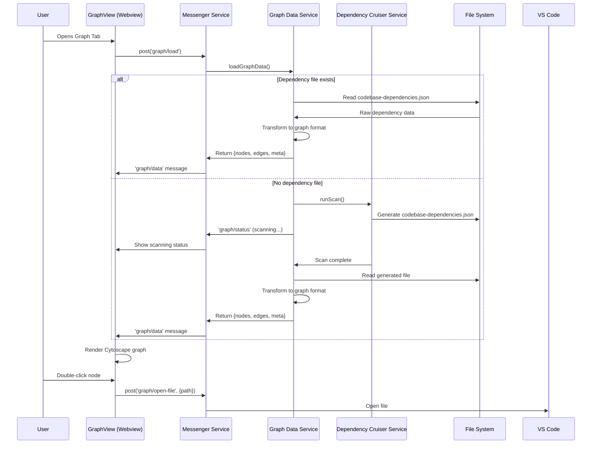

# Design Document

## Overview

The Cytoscape Graph Visualization feature extends the existing Kiro Constellation extension to provide interactive dependency graph visualization. The design leverages the existing messaging architecture, dependency scanning service, and webview infrastructure to create a seamless graph viewing experience within VS Code.

The system follows a request-response pattern where the GraphView webview requests data from the extension, which either serves cached dependency data or triggers a scan to generate it. The graph is rendered using Cytoscape.js with automatic layout and basic interaction capabilities.

## Architecture

### High-Level Data Flow



### Component Architecture

The implementation extends existing components and adds new services:

**Existing Components (Extended):**
- `src/services/messenger.service.ts` - Add graph message handlers
- `webview-ui/src/services/messenger.ts` - Add graph message types
- `src/extension.ts` - Wire graph panel message handling
- `webview-ui/src/views/GraphView.tsx` - Replace placeholder with Cytoscape implementation

**New Components:**
- `src/services/graph-data.service.ts` - Data loading and transformation logic
- Graph-specific message types and interfaces

## Components and Interfaces

### Message Protocol

The messaging system extends the existing centralized messenger with graph-specific message types:

**Webview → Extension Messages:**
```typescript
type GraphInboundMessage = 
  | { type: 'graph/load' }
  | { type: 'graph/open-file'; path: string }
  | { type: 'graph/scan' }

// Extended InboundMessage union in messenger.service.ts
export type InboundMessage = 
  | { type: 'open-graph-view' }
  | { type: 'ping' }
  | GraphInboundMessage
```

**Extension → Webview Messages:**
```typescript
type GraphOutboundMessage =
  | { type: 'graph/data'; payload: GraphData }
  | { type: 'graph/error'; message: string }
  | { type: 'graph/status'; message: string }

// Sent via webview.postMessage() from extension
```

### Data Models

**Core Graph Types:**
```typescript
interface Node {
  id: string;           // workspace-relative path
  label: string;        // file basename
  path: string;         // absolute path for file operations
  language?: 'ts' | 'js' | 'tsx' | 'jsx' | 'json' | 'other';
}

interface Edge {
  id: string;           // `${sourceId}->${targetId}` + optional index
  source: string;       // node id
  target: string;       // node id
  kind?: 'import' | 'require' | 'dynamic' | 'unknown';
}

interface Meta {
  generatedAt?: string;
  count: {
    nodes: number;
    edges: number;
  };
}

interface GraphData {
  nodes: Node[];
  edges: Edge[];
  meta: Meta;
}
```

**Dependency Cruiser Input Format:**
```typescript
interface DepCruiseResult {
  version: 1;
  generatedAt: string;
  workspaceRoot: string;
  depcruise: {
    modules: Array<{
      source: string;           // file path
      dependencies: Array<{
        resolved: string;       // target file path
        dependencyTypes: string[]; // ['esm', 'cjs', 'dynamic', etc.]
      }>;
    }>;
  };
}
```

### Graph Data Service

**Primary Interface:**
```typescript
// src/services/graph-data.service.ts
export async function loadGraphData(
  context: vscode.ExtensionContext
): Promise<GraphData>

export function transformDepCruise(
  depResult: DepCruiseResult, 
  workspaceRoot: string
): GraphData
```

**Implementation Strategy:**
1. **Workspace Detection**: Use `vscode.workspace.workspaceFolders[0]` for workspace root
2. **File Path Resolution**: Compute `.constellation/data/codebase-dependencies.json` path
3. **Conditional Scanning**: If file missing, call existing `runScan()` and poll for completion
4. **Data Transformation**: Convert dependency-cruiser modules array to nodes/edges format
5. **Error Handling**: Return appropriate error messages for missing workspace, scan failures, etc.

**Polling Strategy for Scan Completion:**
```typescript
// Poll every 500ms for up to 30 seconds
const pollForFile = async (filePath: string, timeoutMs: number = 30000) => {
  const startTime = Date.now();
  while (Date.now() - startTime < timeoutMs) {
    if (fs.existsSync(filePath)) return true;
    await new Promise(resolve => setTimeout(resolve, 500));
  }
  return false;
};
```

## Data Models

### Path Handling Strategy

**Node IDs**: Use workspace-relative paths for stability and readability
- Input: `/Users/dev/project/src/components/Button.tsx`
- Workspace: `/Users/dev/project`
- Node ID: `src/components/Button.tsx`
- Node Label: `Button.tsx`
- Node Path: `/Users/dev/project/src/components/Button.tsx` (for file operations)

**Edge IDs**: Deterministic generation to handle potential duplicates
- Format: `${sourceId}->${targetId}`
- Duplicates: Append index if multiple edges exist between same nodes
- Example: `src/app.ts->src/utils.ts`, `src/app.ts->src/utils.ts-1`

### Dependency Type Mapping

Map dependency-cruiser `dependencyTypes` to simplified categories:
```typescript
const mapDependencyKind = (types: string[]): Edge['kind'] => {
  if (types.includes('esm') || types.includes('es6')) return 'import';
  if (types.includes('cjs') || types.includes('commonjs')) return 'require';
  if (types.includes('dynamic')) return 'dynamic';
  return 'unknown';
};
```

## Error Handling

### Graceful Degradation Strategy

**No Workspace**: Return empty graph with appropriate message
**Scan Timeout**: Show error with manual scan suggestion
**Parse Errors**: Log details, show user-friendly error message
**Large Files**: Show loading indicator for files > 5MB during processing

### Error Message Types

```typescript
// Specific error scenarios
const ERROR_MESSAGES = {
  NO_WORKSPACE: 'No workspace folder open. Open a project to view dependencies.',
  SCAN_TIMEOUT: 'Dependency scan timed out. Try running "Constellation: Scan Dependencies" manually.',
  SCAN_FAILED: 'Dependency scan failed. Check the output console for details.',
  PARSE_ERROR: 'Could not parse dependency data. Try re-scanning the project.',
  FILE_TOO_LARGE: 'Dependency file is very large. Graph rendering may take a moment.',
} as const;
```

## Testing Strategy

### Manual Testing Checklist

**Basic Functionality:**
- [ ] Graph renders with nodes and edges
- [ ] Pan and zoom work smoothly
- [ ] Double-click opens correct files
- [ ] Re-scan button triggers new scan

**Performance:**
- [ ] Small projects (< 50 files) render within 3 seconds
- [ ] Large projects show loading indicator appropriately
- [ ] No UI blocking during background scans

**Error Scenarios:**
- [ ] No workspace shows appropriate message
- [ ] Corrupted data file recovers gracefully
- [ ] Scan timeout shows helpful error message

## Implementation Notes

### Cytoscape Integration

**Layout Configuration:**
```typescript
const layoutOptions = {
  name: 'cose',
  fit: true,
  padding: 30,
  nodeRepulsion: 400000,
  idealEdgeLength: 100,
  edgeElasticity: 100,
  nestingFactor: 5,
  gravity: 80,
  numIter: 1000,
  initialTemp: 200,
  coolingFactor: 0.95,
  minTemp: 1.0
};
```

**Styling Strategy:**
```typescript
const styleSheet = [
  {
    selector: 'node',
    style: {
      'background-color': 'var(--vscode-charts-blue, #007ACC)',
      'label': 'data(label)',
      'color': 'var(--vscode-foreground, #CCCCCC)',
      'font-size': '12px',
      'text-valign': 'center',
      'text-halign': 'center',
      'width': '30px',
      'height': '30px'
    }
  },
  {
    selector: 'edge',
    style: {
      'line-color': 'var(--vscode-foreground, #666666)',
      'width': 2,
      'opacity': 0.6,
      'curve-style': 'bezier'
    }
  },
  {
    selector: 'node:selected',
    style: {
      'border-width': 3,
      'border-color': 'var(--vscode-focusBorder, #007FD4)',
      'background-color': 'var(--vscode-charts-orange, #FF8C00)'
    }
  }
];
```

### Performance Considerations

**Large Graph Handling:**
- Show loading indicator for graphs > 200 nodes
- Consider viewport culling for graphs > 1000 nodes (future enhancement)
- Debounce layout recalculation during window resize

**Memory Management:**
- Destroy previous Cytoscape instance before creating new one
- Clean up event listeners on component unmount
- Limit retained graph history to prevent memory leaks

### Future Enhancement Hooks

**Planned Extension Points:**
```typescript
// TODO: File type-based node coloring
const getNodeColor = (language: Node['language']) => { /* ... */ };

// TODO: Dependency strength visualization
const getEdgeWidth = (importCount: number) => { /* ... */ };

// TODO: Cycle detection highlighting
const highlightCycles = (cycles: string[][]) => { /* ... */ };

// TODO: Filter controls
const applyFilters = (filters: GraphFilters) => { /* ... */ };
```

This design provides a solid foundation for M1 while establishing clear extension points for future enhancements like advanced styling, filtering, and cycle detection.