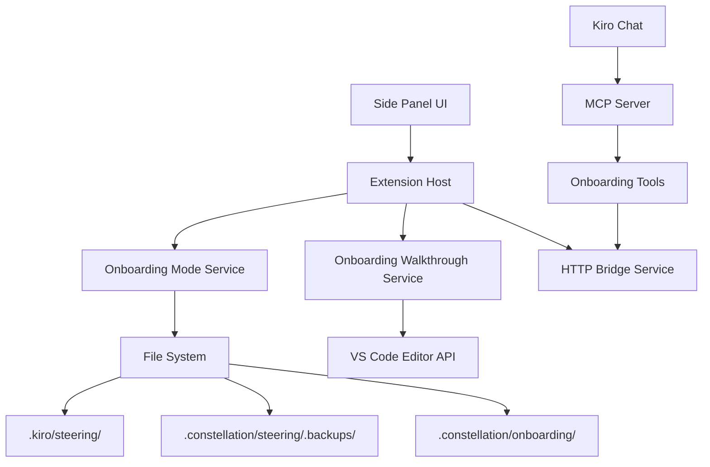

# Design Document

## Overview

The Onboarding Agent Phase 1 feature implements a chat-driven onboarding system that enables users to receive guided walkthroughs of their codebase. The system operates through a mode-switching mechanism in the Side Panel, safe persona management, and structured walkthrough execution via MCP tools. The architecture leverages the existing HTTP bridge for secure communication and integrates seamlessly with the current VS Code extension infrastructure.

## Architecture

### High-Level Architecture



### Component Interaction Flow

1. **Mode Switch**: User selects mode in Side Panel → Extension backs up/restores steering docs
2. **Plan Request**: User asks Kiro for onboarding → Kiro calls `constellation_onboarding.plan`
3. **Plan Commit**: User confirms plan → Kiro calls `constellation_onboarding.commitPlan` → Extension persists and executes first step
4. **Step Progression**: User requests next step → Kiro calls `constellation_onboarding.nextStep` → Extension advances walkthrough

## Components and Interfaces

### Side Panel UI Components

#### OnboardingModeToggle Component
```typescript
interface OnboardingModeToggleProps {
  currentMode: 'Default' | 'Onboarding';
  onModeChange: (mode: 'Default' | 'Onboarding') => void;
  isLoading?: boolean;
}
```

**Responsibilities:**
- Render mode dropdown with confirmation dialogs
- Display current mode indicator
- Handle user interactions and loading states

#### OnboardingStatus Component
```typescript
interface OnboardingStatusProps {
  isActive: boolean;
  currentStep?: number;
  totalSteps?: number;
  currentFile?: string;
  explanation?: string;
}
```

**Responsibilities:**
- Show walkthrough progress when active
- Display current step information
- Provide visual feedback during execution

### Extension Services

#### OnboardingModeService
```typescript
interface OnboardingModeService {
  getCurrentMode(): Promise<'Default' | 'Onboarding'>;
  switchToOnboarding(): Promise<void>;
  switchToDefault(): Promise<void>;
  backupSteeringDocs(): Promise<string>; // returns backup path
  restoreSteeringDocs(): Promise<void>;
}
```

**Responsibilities:**
- Manage mode state and persistence
- Handle steering document backup/restore operations
- Create and manage onboarding persona file
- Validate backup integrity and prevent corruption

#### OnboardingWalkthroughService
```typescript
interface OnboardingWalkthroughService {
  commitPlan(plan: OnboardingPlan): Promise<CommitResult>;
  nextStep(): Promise<StepResult>;
  executeStep(stepIndex: number): Promise<void>;
  getCurrentState(): WalkthroughState | null;
  clearState(): void;
}

interface OnboardingPlan {
  version: number;
  topic: string;
  createdAt: string;
  steps: OnboardingStep[];
}

interface OnboardingStep {
  filePath: string;
  lineStart: number;
  lineEnd: number;
  explanation: string;
}
```

**Responsibilities:**
- Manage active walkthrough state (in-memory)
- Validate and persist onboarding plans
- Execute individual walkthrough steps
- Handle file opening and range highlighting
- Coordinate with VS Code editor API

### MCP Tools

#### constellation_onboarding.plan
```typescript
interface PlanToolInput {
  request: string;
}

interface PlanToolOutput {
  plan: OnboardingPlan;
  userSummary: string;
}
```

**Responsibilities:**
- Analyze repository context and user request
- Generate structured walkthrough plan
- Return both internal plan and user-friendly summary
- Validate plan structure before returning

#### constellation_onboarding.commitPlan
```typescript
interface CommitPlanInput {
  plan: OnboardingPlan;
}

interface CommitPlanOutput {
  status: 'started';
  stepCount: number;
  planPath: string;
}
```

**Responsibilities:**
- Validate plan schema and file existence
- Persist plan to filesystem
- Initialize walkthrough execution
- Execute first step immediately

#### constellation_onboarding.nextStep
```typescript
interface NextStepInput {}

interface NextStepOutput {
  status: 'ok' | 'complete';
  currentStepIndex?: number;
}
```

**Responsibilities:**
- Advance to next step in active plan
- Execute step (file opening and highlighting)
- Handle completion state
- Return appropriate status

### HTTP Bridge Endpoints

#### POST /persona
```typescript
interface PersonaRequest {
  action: 'enable' | 'disable';
}

interface PersonaResponse {
  success: boolean;
  mode: 'Default' | 'Onboarding';
  message?: string;
}
```

#### POST /onboarding/commitPlan
```typescript
interface CommitPlanRequest {
  plan: OnboardingPlan;
}

interface CommitPlanResponse {
  status: 'started';
  stepCount: number;
  planPath: string;
}
```

#### POST /onboarding/nextStep
```typescript
interface NextStepRequest {}

interface NextStepResponse {
  status: 'ok' | 'complete';
  currentStepIndex?: number;
}
```

## Data Models

### OnboardingPlan Schema
```json
{
  "version": 1,
  "topic": "string",
  "createdAt": "ISO 8601 timestamp",
  "steps": [
    {
      "filePath": "workspace-relative path",
      "lineStart": "1-based inclusive line number",
      "lineEnd": "1-based inclusive line number", 
      "explanation": "concise step description"
    }
  ]
}
```

### WalkthroughState (In-Memory)
```typescript
interface WalkthroughState {
  plan: OnboardingPlan;
  currentStepIndex: number;
  planPath: string;
  startedAt: Date;
}
```

### Backup Metadata
```typescript
interface BackupMetadata {
  timestamp: string;
  originalPath: string;
  backupPath: string;
  fileCount: number;
  checksum?: string;
}
```

## Error Handling

### Error Categories

#### File System Errors
- **Backup Failures**: Graceful degradation with user notification, no mode change
- **Restore Failures**: Attempt partial restore, clear error messaging
- **Permission Issues**: Detailed error messages with suggested actions

#### Validation Errors
- **Invalid Plans**: Schema validation with specific error details
- **Path Traversal**: Security validation with rejection and logging
- **File Not Found**: Graceful handling with user notification

#### Network/Communication Errors
- **HTTP Bridge Failures**: Retry logic with exponential backoff
- **MCP Tool Errors**: Structured error responses with context
- **Timeout Handling**: Clear timeout messages with retry options

### Error Response Format
```typescript
interface ErrorResponse {
  error: string;
  code: string;
  details?: Record<string, any>;
  suggestions?: string[];
}
```

### Security Testing
- **Path Traversal**: Attempt directory traversal attacks
- **Authentication**: Verify bearer token validation
- **Input Validation**: Test malformed JSON and oversized requests
- **Workspace Boundaries**: Ensure file operations stay within workspace

### Performance Testing
- **Large Plans**: Test with plans containing many steps
- **File Operations**: Measure backup/restore performance
- **Memory Usage**: Monitor in-memory state management
- **Concurrent Operations**: Test multiple simultaneous requests

## Security Considerations

### File System Security
- All file paths validated as workspace-relative
- Directory traversal prevention (`..`, absolute paths)
- Backup operations use atomic writes where possible
- Restore operations validate backup integrity

### Network Security
- HTTP bridge restricted to loopback (127.0.0.1) only
- Bearer token authentication for all endpoints
- Request size limits to prevent DoS
- Input sanitization and validation

### Data Protection
- Steering document backups preserve permissions
- Temporary files cleaned up on errors
- No sensitive data logged or exposed
- Graceful handling of permission errors

## Performance Optimizations

### File Operations
- Streaming for large backup operations
- Incremental backup detection to avoid redundancy
- Lazy loading of plan data
- Efficient path normalization algorithms

### Memory Management
- In-memory state limited to active walkthrough only
- Automatic cleanup on completion or error
- Efficient JSON parsing for large plans
- Resource cleanup on extension deactivation

### User Experience
- Non-blocking operations where possible
- Progress indicators for long-running tasks
- Immediate feedback for user actions
- Graceful degradation on errors