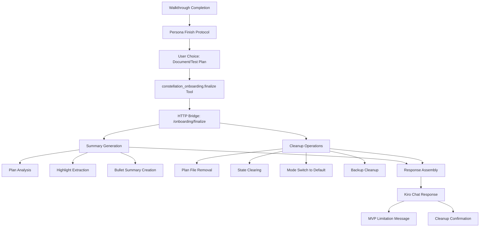

# Design Document

## Overview

The Onboarding Agent Phase 2 feature extends the existing onboarding system with a comprehensive end-of-tour experience. The design focuses on providing users with meaningful closure through structured summaries and cleanup automation. The architecture leverages the existing HTTP bridge and MCP infrastructure while adding new finalization capabilities that ensure workspace consistency and user satisfaction.

## Architecture

### High-Level Architecture



### Component Interaction Flow

1. **Completion Detection**: `nextStep()` returns status "complete"
2. **Persona Activation**: Onboarding persona presents two offers
3. **User Selection**: User chooses document/test-plan option
4. **Tool Invocation**: Persona calls `constellation_onboarding.finalize`
5. **Summary Generation**: System analyzes current plan and generates structured summary
6. **Cleanup Execution**: System performs comprehensive cleanup operations
7. **Response Delivery**: Kiro presents summary + MVP limitation message
8. **State Reset**: Side Panel shows Default mode with no active status

## Components and Interfaces

### MCP Tool: constellation_onboarding.finalize

#### Input Schema
```typescript
interface FinalizeToolInput {
  chosenAction: 'document' | 'test-plan' | null;
}
```

#### Output Schema
```typescript
interface FinalizeToolOutput {
  status: 'done';
  chosenAction: 'document' | 'test-plan' | null;
  summary: {
    topic: string;
    stepCount: number;
    files: string[];
    highlights: Array<{
      filePath: string;
      lineStart: number;
      lineEnd: number;
    }>;
    bulletSummary: string[];
  };
  cleanup: {
    mode: 'Default';
    removedPlan: string | null;
  };
}
```

### HTTP Bridge Extension

#### New Endpoint: POST /onboarding/finalize
```typescript
interface FinalizeRequest {
  chosenAction: 'document' | 'test-plan' | null;
}

interface FinalizeResponse {
  status: 'done';
  chosenAction: 'document' | 'test-plan' | null;
  summary: SummaryData;
  cleanup: CleanupData;
}
```

**Security:**
- Existing loopback + bearer token authentication
- Input validation and JSON size limits
- Workspace boundary enforcement

### Enhanced OnboardingWalkthroughService

#### New Methods
```typescript
interface OnboardingWalkthroughService {
  // Existing methods...
  getSummary(): SummaryData;
  cleanup(options: { removePlan: boolean }): Promise<void>;
}

interface SummaryData {
  topic: string;
  stepCount: number;
  files: string[];
  highlights: HighlightData[];
  bulletSummary: string[];
}

interface HighlightData {
  filePath: string;
  lineStart: number;
  lineEnd: number;
}
```

**getSummary() Implementation:**
- Reads current in-memory walkthrough state
- Extracts unique file paths from plan steps
- Creates highlight objects from step line ranges
- Generates bullet summary from step explanations (max 10 items)
- Returns empty defaults if no active state

**cleanup() Implementation:**
- Deletes tracked plan file from `.constellation/onboarding/`
- Clears in-memory walkthrough state
- Calls OnboardingModeService.switchToDefault()
- Handles errors gracefully without throwing

### Enhanced OnboardingModeService

#### Updated switchToDefault() Method
```typescript
interface OnboardingModeService {
  // Existing methods...
  switchToDefault(): Promise<void>;
}
```

**Enhanced Behavior:**
- Restores steering documents from latest backup
- Removes all backup directories from `.constellation/steering/.backups/`
- Creates empty `.kiro/steering` if restoration fails
- Updates mode state to "Default"
- Handles permission errors gracefully

### Persona Template Updates

#### Finish Protocol Addition
```markdown
## Finish Protocol

After the final step completes:

1. Present exactly two offers:
   - "Summarize and document this feature"
   - "Suggest unit testing plan"

2. On user selection, call finalize tool:
   ```
   #[constellation-mcp] constellation_onboarding.finalize { "chosenAction": "document" }
   ```

3. Display returned summary content

4. Explain MVP limitation: "Sorry, this feature is not in the MVP."

5. Confirm cleanup completion and Default mode restoration
```

## Data Models

### Summary Generation Algorithm

#### File Extraction
```typescript
function extractFiles(plan: OnboardingPlan): string[] {
  const uniqueFiles = new Set<string>();
  plan.steps.forEach(step => {
    uniqueFiles.add(step.filePath);
  });
  return Array.from(uniqueFiles).sort();
}
```

#### Highlight Extraction
```typescript
function extractHighlights(plan: OnboardingPlan): HighlightData[] {
  return plan.steps.map(step => ({
    filePath: step.filePath,
    lineStart: step.lineStart,
    lineEnd: step.lineEnd
  }));
}
```

#### Bullet Summary Generation
```typescript
function generateBulletSummary(plan: OnboardingPlan): string[] {
  const bullets = plan.steps
    .map(step => step.explanation.trim())
    .filter(explanation => explanation.length > 0)
    .slice(0, 10) // Maximum 10 items
    .map(explanation => {
      // Trim to single line, max 100 characters
      const singleLine = explanation.replace(/\n/g, ' ').trim();
      return singleLine.length > 100 
        ? singleLine.substring(0, 97) + '...'
        : singleLine;
    });
  
  return bullets;
}
```

### Cleanup Operation Sequence

#### Plan File Removal
```typescript
async function removePlanFile(planPath: string): Promise<string | null> {
  try {
    if (fs.existsSync(planPath)) {
      await fs.promises.unlink(planPath);
      return path.relative(workspaceRoot, planPath);
    }
    return null;
  } catch (error) {
    console.warn('Failed to remove plan file:', error);
    return null;
  }
}
```

#### Backup Cleanup
```typescript
async function cleanupBackups(): Promise<void> {
  const backupDir = '.constellation/steering/.backups';
  try {
    if (fs.existsSync(backupDir)) {
      await fs.promises.rm(backupDir, { recursive: true, force: true });
    }
  } catch (error) {
    console.warn('Failed to cleanup backups:', error);
    // Continue with other cleanup operations
  }
}
```

## Error Handling

### Error Categories and Responses

#### Summary Generation Errors
- **No Active State**: Return empty summary with stepCount=0
- **Malformed Plan**: Use available data, skip invalid steps
- **File Path Issues**: Include paths as-is, let UI handle display

#### Cleanup Operation Errors
- **Plan File Deletion**: Log warning, set removedPlan=null, continue
- **Backup Restoration**: Create empty steering directory, continue
- **Permission Errors**: Log warnings, complete other operations
- **Mode Switch Failures**: Attempt partial cleanup, report status

#### HTTP Bridge Errors
- **Invalid JSON**: Return 400 with structured error
- **Authentication Failure**: Return 401 with clear message
- **Internal Errors**: Return 500 with generic message, log details

### Error Response Format
```typescript
interface ErrorResponse {
  error: string;
  code: 'INVALID_INPUT' | 'CLEANUP_FAILED' | 'INTERNAL_ERROR';
  details?: {
    operation?: string;
    partialSuccess?: boolean;
  };
}
```

### Graceful Degradation Strategy
1. **Best Effort Cleanup**: Complete as many operations as possible
2. **Status Reporting**: Accurately report what was accomplished
3. **User Communication**: Clear messages about any limitations
4. **State Consistency**: Ensure workspace remains in valid state

## Security Considerations

### Path Validation
- All file operations validated against workspace boundaries
- Plan file paths restricted to `.constellation/onboarding/`
- Backup paths restricted to `.constellation/steering/.backups/`
- No absolute paths or directory traversal in responses

### Authentication
- Reuse existing HTTP bridge bearer token system
- Loopback-only access (127.0.0.1)
- Request size limits to prevent DoS
- Input sanitization for all parameters

### Data Protection
- No sensitive data in summary responses
- Workspace-relative paths only in output
- Secure cleanup of temporary files
- Proper error logging without data leakage

## Performance Optimizations

### Summary Generation
- In-memory processing of plan data (no file I/O)
- Efficient string operations for bullet generation
- Minimal object creation during extraction
- Early termination for large step counts

### Cleanup Operations
- Parallel execution where safe (file deletion + mode switch)
- Atomic operations where possible
- Minimal filesystem traversal
- Efficient backup directory removal

### Memory Management
- Clear in-memory state immediately after summary generation
- No retention of plan data after cleanup
- Efficient string handling for large explanations
- Proper resource cleanup on errors

## Testing Strategy

### Unit Tests
- Summary generation with various plan structures
- Cleanup operations with different error scenarios
- Path validation and security checks
- Error handling and graceful degradation

### Integration Tests
- End-to-end finalize flow through HTTP bridge
- MCP tool integration with various inputs
- Persona protocol execution
- UI state updates after cleanup

### Edge Case Testing
- Empty plans and missing state
- Permission errors during cleanup
- Large plans with many steps
- Concurrent finalize requests
- Invalid chosenAction values

### Security Testing
- Directory traversal attempts
- Authentication bypass attempts
- Oversized request handling
- Path injection attacks

## Performance Metrics

### Response Time Targets
- Summary generation: <100ms for typical plans
- Cleanup operations: <500ms for normal workspaces
- Total finalize time: <1 second end-to-end
- HTTP bridge response: <200ms excluding cleanup

### Resource Usage
- Memory: <10MB additional during finalize
- Disk I/O: Minimal (plan file deletion only)
- CPU: Low impact on extension performance
- Network: Single HTTP request to bridge

## Migration and Compatibility

### Backward Compatibility
- No changes to existing Phase 1 APIs
- Existing walkthrough state format unchanged
- Current persona behavior preserved until completion
- No breaking changes to HTTP bridge authentication

### Data Migration
- No migration required (new functionality only)
- Existing plan files remain compatible
- Current backup format unchanged
- State management remains in-memory only

### Rollback Strategy
- Feature can be disabled by removing MCP tool registration
- Existing cleanup mechanisms remain functional
- No persistent state changes that require migration
- Graceful handling of missing finalize tool