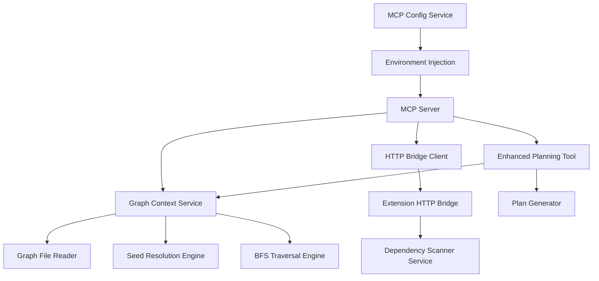

# Design Document

## Overview

The Onboarding Agent Phase 3 feature enhances the existing onboarding system by integrating dependency graph context into the planning process. This design builds upon the established MCP server architecture and HTTP bridge pattern to provide graph-aware onboarding plans that are more contextual and comprehensive.

The system will read precomputed dependency-cruiser graph data, compute neighborhoods of related files around seed files or topics, and enrich the planning tool output with this contextual information. This enables the onboarding agent to create more grounded and relevant step-by-step plans.

## Architecture

### High-Level Components



### Data Flow

1. **Environment Setup**: MCP config service injects `CONSTELLATION_WORKSPACE_ROOT` into MCP server environment
2. **Plan Request**: Agent calls `constellation_onboarding.plan` with seed file or topic
3. **Graph Loading**: System attempts to read graph file from workspace
4. **Scan Trigger**: If graph missing, HTTP bridge triggers dependency scan
5. **Context Computation**: BFS traversal computes related files around seed
6. **Enriched Response**: Plan tool returns both plan and graph context

## Components and Interfaces

### Environment Injection Service

**Location**: `src/services/mcp-config.service.ts` (enhancement)

```typescript
interface McpEnvironment {
  CONSTELLATION_SERVER_ID: string;
  CONSTELLATION_BRIDGE_PORT: string;
  CONSTELLATION_BRIDGE_TOKEN: string;
  CONSTELLATION_WORKSPACE_ROOT: string; // NEW
}
```

**Responsibilities**:
- Inject workspace root path into MCP server environment
- Support both user-level and workspace-level configurations
- Maintain backward compatibility with existing environment variables

### HTTP Bridge Scan Endpoint

**Location**: `src/services/http-bridge.service.ts` (enhancement)

```typescript
interface ScanRequest {}

interface ScanResponse {
  status: 'ok' | 'error';
  error?: string;
}
```

**Endpoint**: `POST /scan`
**Responsibilities**:
- Trigger dependency scan using existing `runScan(context)` service
- Poll for graph file existence with 30-second timeout
- Return structured success/error responses
- Maintain loopback-only security with bearer authentication

### Graph Context Service

**Location**: `src/mcp.server.ts` (new service within MCP server)

```typescript
interface GraphContext {
  seedId: string | null;
  relatedFiles: string[];
  depth: number;
  limit: number;
}

interface EnrichedPlanResponse {
  plan: OnboardingPlan;
  context: GraphContext;
}
```

**Responsibilities**:
- Read and parse dependency graph JSON files
- Resolve seed files/topics to graph node IDs
- Perform BFS traversal to find related files
- Rank and limit results for optimal performance

### Seed Resolution Engine

**Location**: Within Graph Context Service

```typescript
interface SeedResolutionHeuristics {
  exactMatch(seedPath: string, nodeIds: string[]): string | null;
  caseInsensitiveMatch(seedPath: string, nodeIds: string[]): string | null;
  extensionSwaps(seedPath: string, nodeIds: string[]): string | null;
  basenameScoring(seedPath: string, nodeIds: string[]): string | null;
  topicMatching(topic: string, nodeIds: string[]): string | null;
}
```

**Responsibilities**:
- Implement consistent resolution logic with impact analysis service
- Handle file path normalization and workspace-relative conversion
- Support both file-based and topic-based seed resolution
- Provide fallback mechanisms for unresolved seeds

### BFS Traversal Engine

**Location**: Within Graph Context Service

```typescript
interface TraversalConfig {
  depth: number; // Default: 1
  limit: number; // Default: 30
  direction: 'forward' | 'reverse' | 'union'; // Default: 'union'
}

interface TraversalResult {
  relatedFiles: string[];
  stats: {
    nodesVisited: number;
    edgesTraversed: number;
    maxDepth: number;
  };
}
```

**Responsibilities**:
- Build adjacency maps from graph data (forward and reverse)
- Perform depth-limited BFS traversal
- Rank results by distance and degree
- Clamp results to configured limits

## Data Models

### Graph Data Structure

```typescript
interface GraphNode {
  id: string; // workspace-relative path
  label?: string;
  type?: string;
}

interface GraphEdge {
  source: string; // importer
  target: string; // imported
  type?: string;
}

interface GraphData {
  nodes: GraphNode[];
  edges: GraphEdge[];
  metadata?: {
    scanTime: string;
    fileCount: number;
    dependencyCount: number;
  };
}
```

### Enhanced Plan Tool Schema

```typescript
interface PlanToolInput {
  request: string; // User's learning request
  seedFile?: string; // Optional specific file to focus on
}

interface PlanToolOutput {
  plan: OnboardingPlan;
  context: GraphContext;
  userSummary: string;
}
```

### Configuration Schema

```typescript
interface GraphContextConfig {
  defaultDepth: number; // Default: 1
  defaultLimit: number; // Default: 30
  scanTimeout: number; // Default: 30000ms
  enableTopicMatching: boolean; // Default: true
}
```

## Error Handling

### Error Categories

1. **Environment Errors**
   - Missing workspace root
   - Invalid workspace path
   - Permission issues

2. **Graph Data Errors**
   - Missing graph file
   - Malformed JSON data
   - Scan timeout failures

3. **Resolution Errors**
   - Unresolvable seed files/topics
   - Invalid path formats
   - Security violations

4. **Network Errors**
   - HTTP bridge unavailable
   - Request timeout
   - Authentication failures

### Error Response Format

```typescript
interface ErrorResponse {
  error: string;
  code?: string;
  context?: {
    seedId: null;
    relatedFiles: [];
    depth: 0;
    limit: 0;
  };
}
```

### Fallback Strategies

- **Missing Graph**: Trigger scan once, retry, then proceed with empty context
- **Unresolved Seed**: Continue with empty related files but valid plan
- **Network Failure**: Return plan without graph context
- **Large Graphs**: Apply aggressive limits and simplified traversal

## Testing Strategy

### Unit Tests

1. **Environment Injection**
   - Verify workspace root injection in both user and workspace configs
   - Test environment variable precedence and merging
   - Validate backward compatibility

2. **Seed Resolution**
   - Test exact, case-insensitive, and extension swap matching
   - Verify basename scoring algorithm
   - Test topic-to-file mapping heuristics

3. **BFS Traversal**
   - Test depth-limited traversal correctness
   - Verify cycle detection and prevention
   - Test ranking and limiting algorithms

4. **HTTP Bridge**
   - Test scan endpoint trigger and polling
   - Verify timeout handling and error responses
   - Test security and authentication

### Integration Tests

1. **End-to-End Planning**
   - Test complete flow from plan request to enriched response
   - Verify graph context integration with plan generation
   - Test fallback scenarios with missing data

2. **Performance Tests**
   - Test with large graphs (500+ nodes)
   - Verify timeout handling and resource limits
   - Test memory usage and cleanup

3. **Security Tests**
   - Verify workspace boundary enforcement
   - Test path traversal prevention
   - Validate authentication and authorization

### Test Data

- Small test graphs (10-20 nodes) for unit tests
- Medium graphs (100-200 nodes) for integration tests
- Large synthetic graphs (500+ nodes) for performance tests
- Malformed JSON files for error handling tests

## Security Considerations

### Path Security

- All file paths must be workspace-relative
- Prevent directory traversal attacks (`../` sequences)
- Validate paths against workspace boundaries
- No symlink following outside workspace

### Network Security

- HTTP bridge remains loopback-only (127.0.0.1)
- Bearer token authentication for all requests
- Request size limits (1MB) to prevent DoS
- Input validation and sanitization

### Data Security

- No absolute paths in responses
- Sanitize error messages to prevent information leakage
- Log security violations for monitoring
- Validate JSON parsing with size limits

## Performance Optimizations

### Graph Processing

- Lazy loading of graph data
- Compact adjacency map representation
- Depth-limited traversal to prevent exponential growth
- Result caching for repeated requests

### Memory Management

- Stream JSON parsing for large files
- Garbage collection of temporary structures
- Configurable limits on result sets
- Early termination for oversized graphs

### Network Optimization

- Single retry policy for scan requests
- Timeout handling with graceful degradation
- Efficient polling intervals (500ms)
- Connection reuse where possible

## Deployment Considerations

### Configuration Management

- Environment variables injected automatically
- No manual configuration required
- Backward compatibility with existing setups
- Graceful degradation when features unavailable

### Monitoring and Logging

- Performance metrics for graph operations
- Error tracking and categorization
- Security event logging
- User experience metrics

### Rollback Strategy

- Feature flags for graph context integration
- Fallback to basic planning when graph unavailable
- Incremental deployment with monitoring
- Quick disable mechanism for issues