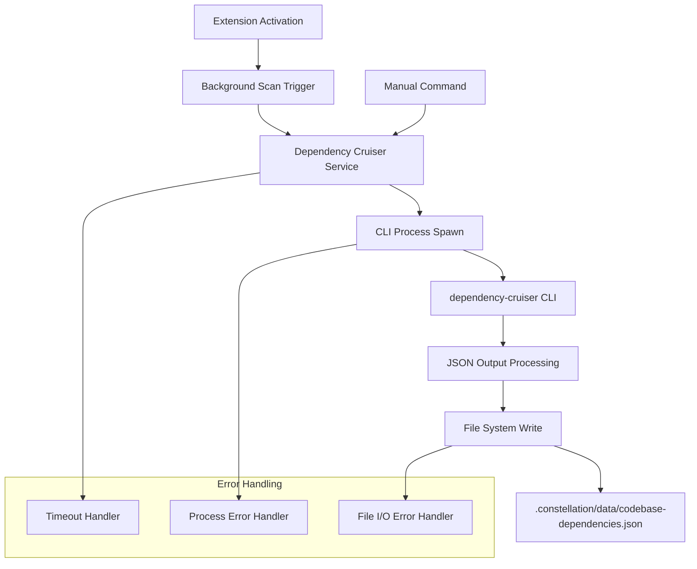

# Design Document

## Overview

The Dependency Cruiser integration adds automated codebase analysis capabilities to the Kiro Constellation VS Code extension. The system uses the dependency-cruiser CLI tool to generate comprehensive dependency graphs of JavaScript/TypeScript projects, storing results in a structured JSON format for future consumption by UI components or other analysis tools.

## Architecture

### High-Level Architecture



### Service Layer Integration

The dependency cruiser functionality integrates into the existing service layer pattern:

- `src/services/dependency-cruiser.service.ts` - New service following kebab-case naming convention
- Follows the same async/non-blocking pattern as existing MCP configuration services
- Integrates with VS Code's extension context for path resolution

## Components and Interfaces

### Core Service Interface

```typescript
// src/services/dependency-cruiser.service.ts
export async function runScan(context: vscode.ExtensionContext): Promise<void>
```

### CLI Integration Strategy

**Process Spawning Approach:**
- Use Node.js `child_process.spawn()` to execute dependency-cruiser CLI
- Avoids ESM/CommonJS interop issues by calling the CLI directly
- Provides better control over process lifecycle and timeout handling

**CLI Path Resolution:**
```typescript
const cliPath = path.join(
  context.extensionUri.fsPath, 
  'node_modules', 
  'dependency-cruiser', 
  'bin', 
  'depcruise.js'
)
```

**Command Arguments:**
```bash
node depcruise.js \
  --output-type json \
  --exclude "node_modules|dist|out|build|coverage|\.git|\.vscode|\.constellation" \
  [--ts-config tsconfig.json] \
  <workspace-root>
```

### Output Data Structure

**File Location:** `.constellation/data/codebase-dependencies.json`

**Envelope Format:**
```typescript
interface DependencyAnalysisResult {
  version: 1;
  generatedAt: string; // ISO timestamp
  workspaceRoot: string; // Absolute path
  depcruise: any; // Raw dependency-cruiser output
}
```

**Rationale for Envelope:**
- Version field enables future schema evolution
- Metadata provides context for consumers
- Raw tool output preservation maintains full fidelity

## Data Models

### Workspace Detection

```typescript
interface WorkspaceInfo {
  root: string; // Absolute path to workspace root
  hasTsConfig: boolean; // Whether tsconfig.json exists
}
```

### Process Management

```typescript
interface ScanProcess {
  child: ChildProcess;
  timeout: NodeJS.Timeout;
  stdout: string[];
  promise: Promise<string>;
}
```

### Configuration Detection

The service will detect and utilize existing TypeScript configuration:

1. Check for `tsconfig.json` in workspace root
2. If present, add `--ts-config` argument to CLI invocation
3. This improves analysis accuracy for TypeScript projects

## Error Handling

### Timeout Management

- **Timeout Duration:** 60 seconds maximum
- **Timeout Behavior:** Kill child process gracefully, log warning, continue
- **Rationale:** Prevents hanging on large repositories while allowing reasonable scan time

### Process Error Handling

```typescript
// Error scenarios and responses:
1. CLI not found -> Log warning, continue (no user notification)
2. Process spawn failure -> Log error, continue
3. Non-zero exit code -> Log warning with exit code, continue
4. JSON parse failure -> Log error, continue
5. File I/O failure -> Log error, continue
```

### Graceful Degradation

- All errors are logged but do not surface to users in v1
- Extension continues normal operation if dependency scanning fails
- No blocking behavior or error toasts that disrupt workflow

## Testing Strategy

### Unit Testing Approach

1. **Service Function Testing:**
   - Mock `vscode.workspace.workspaceFolders`
   - Mock file system operations
   - Test CLI argument construction
   - Test timeout behavior

2. **Integration Testing:**
   - Test with real small TypeScript project
   - Verify output file creation and format
   - Test error scenarios (missing CLI, invalid workspace)

3. **Performance Testing:**
   - Test timeout behavior with long-running mock process
   - Verify non-blocking activation behavior

### Test Data Requirements

- Sample TypeScript project with known dependency structure
- Expected dependency-cruiser output for validation
- Mock scenarios for error conditions

## Implementation Phases

### Phase 1: Core Service Implementation
- Create `dependency-cruiser.service.ts`
- Implement basic CLI spawning and output capture
- Add timeout and error handling
- Write output file with envelope format

### Phase 2: Extension Integration
- Add dependency to `package.json`
- Wire service into extension activation
- Add manual command registration
- Ensure non-blocking background execution

### Phase 3: Configuration and Polish
- Add optional settings for scan control
- Improve error logging and diagnostics
- Add file system error handling
- Validate cross-platform compatibility

## Security Considerations

### Process Execution Safety
- CLI path is resolved relative to extension installation
- No user input is passed to CLI arguments
- Workspace path is validated before use

### File System Access
- Output directory creation uses recursive mkdir
- File writes are atomic (writeFile operation)
- No sensitive data exposure in output files

## Performance Considerations

### Background Execution
- Scan runs asynchronously without blocking UI
- Uses fire-and-forget pattern for activation integration
- Timeout prevents indefinite resource consumption

### Resource Management
- Child process cleanup on timeout or completion
- Stdout buffering with reasonable limits
- File I/O uses efficient Node.js APIs

### Scalability Factors
- Scan time scales with project size
- Memory usage scales with dependency graph complexity
- Timeout provides upper bound on resource consumption